<div align="center">
  
</div>


## Introduction

Throughout my data science journey, I have learned that it is a good practice to understand the data first and try to gather as many insights from it. Exploratory Data Analysis (EDA) is all about making sense of data in hand, before getting dirty with machine learning and sophisticated algorithm. 

While there are plenty of Python libraries that can help create beautiful and complex visualizations, I often find myself starting with the most simplistic analyses: count plot, histogram, scatter plot, boxplot, etc. This initial EDA workflow is very similar for each new data set. But unfortunately, they are tedious. Converting to correct data types, selecting the right variable type for the right plot, iterate through all possible variable combinations, adjusting plot aesthetics and labels, etc. These are the tasks I would love to do... once. As someone that does not find great joy in completing repetitive tasks, I set out to build a tool that allows me to be as lazy as possible.

## Description
Auto_EDA is a python library that automates common tasks in your exploratory data analysis. This includes missing values visualization, missing values handling, variable types handling, predictive modeling, and a variety of univariate and bivariate graphs. The goal is to provide a fast and effective tool for discovering insights, so you can quickly move on to the machine learning model.

### Features

- Smart data type conversion
- Automatic graph discovery
- Simple missing values identificaiton and handling
- CART model with cross-validation and tree visualization

# Table of Contents

- [Table of contents](#table-of-contents)
- [Installation](#installation)
- [Dataset Overview](#dataset-overview)
- [Missing Values](#Missing-Values)
  - [Identify Missing Values](#Identify-Missing-Values)
  - [Handle Missing Values](#Handling-missing-values)
- [Variable Types Handling](#Variable-Types)
  - [Identify data types](#Identify-data-types-from-Pandas)
  - [Type conversions](#Handle-suggested-type-conversions)
- [Visualization](#Visualization)
  - [Univariate plots](#Univariate-plots)
    - [Histogram](#Histogram)
    - [Count Plots](#Count-plots)
    - [Word Cloud](#Word-cloud)
  - [Bivariate plots](#Bivariate-plots)
    - [Correlation plots](#Correlation-plots)
    - [Principal Component Analysis](#Principal-Component-Analysis)
    - [Box Plots](#Box-plots)
    - [Relative Frequency Plots](#Relative-frequency-plots)
    - [Correspondence Analysis](#Correspondence-Analysis)
    - [Trend plot](#Trend-plot)
- [Decision Tree Visualizer](#Statistical-Modeling)
  

## Installation

:warning: Auto_EDA is only compatible with **Python 3**.

:warning: Decision Tree visualizer requires [graphviz](https://github.com/parrt/dtreeviz).

**Install Via GitHub**

```sh
> pip install git+https://github.com/GrandPurpleOcelot/Auto-EDA 
```
## Usage

```python
from auto_eda import *;
```

Initiate a class instance with input dataframe:

```python
heart = pd.read_csv('datasets/heart.csv')
heart['target'] = np.where(heart['target'] == 1, 'has disease', 'no disease')

report = auto_eda(heart, target_variable = 'target')
```

The available parameters are:

- `df`: the input pandas dataframe.
- `target_variable`: the target variable that Auto_EDA will focus on.

##  Dataset Overview

```python
report.get_samples()
```

get_samples() returns a df concatenated from head + random samples + tail of the dataset.

<div align="center">
  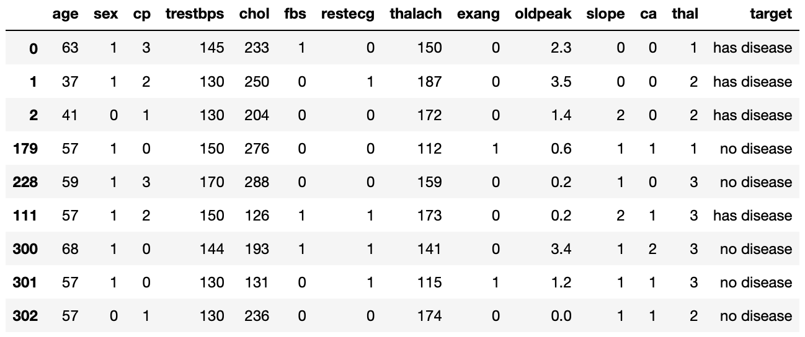
</div>

```python
>>> report.get_overview()

Number of Variables: 303
Number of Observations: 14
Memory Usage: 0.052106 Mb
```
get_samples() returns number of variables, observations, and memory usage.


## Missing Values

### Identify Missing Values

```python
report.get_missings(missing_tag= '?')
```

<div align="center">
  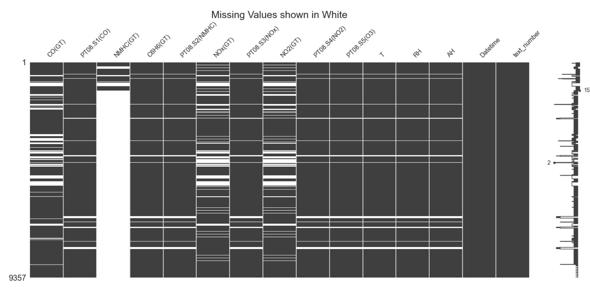
</div>

<div align="center">
  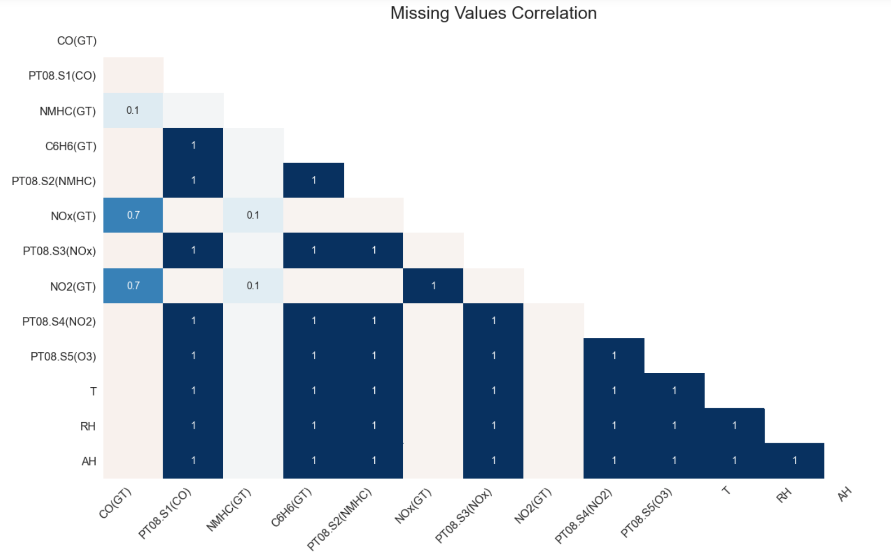
</div>

<div align="center">
  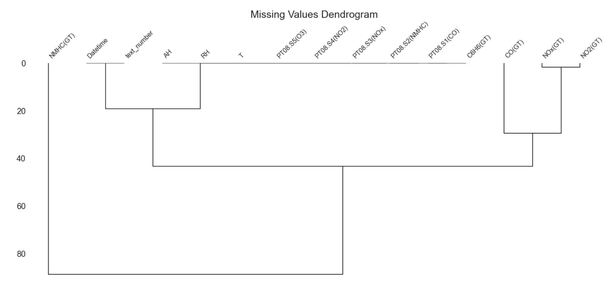
</div>

The available parameters are:

- `missing_tag`: Sometimes missing values are denoted with a number or string (eg. '?'), enter the missing tag to replace them with NAs


### Handling missing values

```python
>>> report.handle_missings(strategy = 'deletion', drop_threshold = 0.5)

Dropped columns: ['NMHC(GT)']
Number of dropped rows: 2416 --> 25.8% of rows removed
```

The available parameters are:

- `strategy`: select a strategy to handle missing data. Options: 'deletion', 'encode', 'mean_mode'

'deletion': drop variables with > 70% missing (or a different threshold using argument 'drop_threshold') and remove observations that contain at least 1 missing value.

'encode'(Encoding imputation): for numerical variable, encoding missing entries as -999. For categorical variable, encoding missing entries as string "unknown"

'mean_mode'(Mean/mode imputation): for numerial variable, impute the missing entries with the mean. For categorical variable, impute the missing entries with the mode

- `drop_threshold`: if 'deletion' strategy is selected, any column that have fraction of missing values exceed drop_threshold will be dropped. drop_threshold = 1 will keep all columns. Default drop_threshold = 0.7.

## Variable Types

### Identify Data Types

```python
report.check_data_type()
```
<div align="center">
  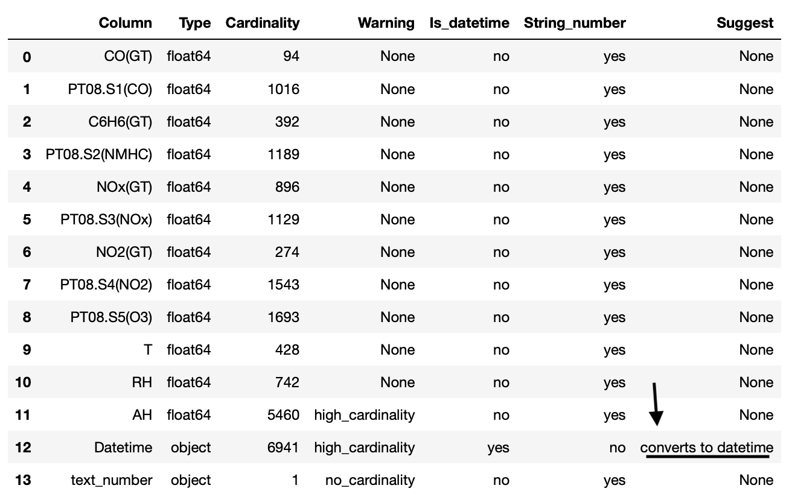
</div>

**Type conversion suggestions:**

 * String datetime -> datetime
 
 * Small interger (for example: boolean)  -> categorical type
 
 * String float -> float
 
 * Maximum cardinality (number of unique == number of observations) -> remove
 
### Handle Suggested Type Conversions:

```python
>>> report.change_data_type()

Column Datetime converts to datetime
```

## Visualization

### Univariate Plots

#### Histogram

Exploratory type: **numerical** data

```python
report.histogram()
```

<div align="center">
  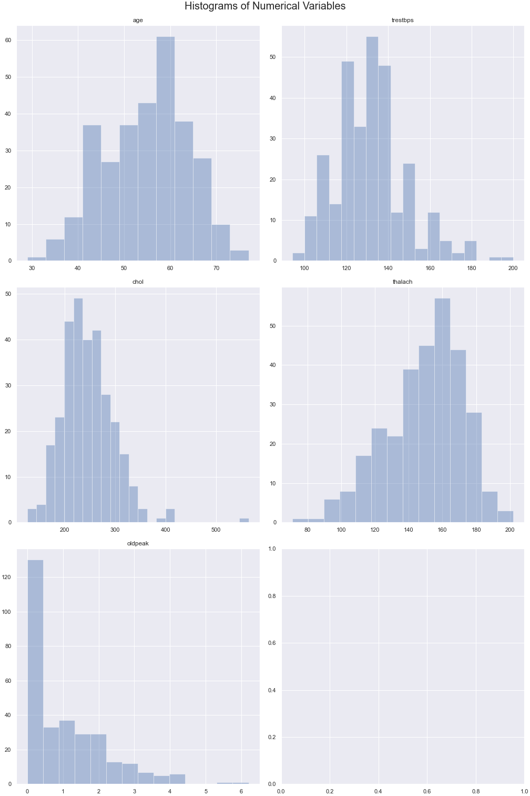
</div>

The available parameters are:

- `kde`: boolean (default = False).

#### Count Plots

Exploratory type: **categorical** data

```python
report.count_plots()
```

<div align="center">
  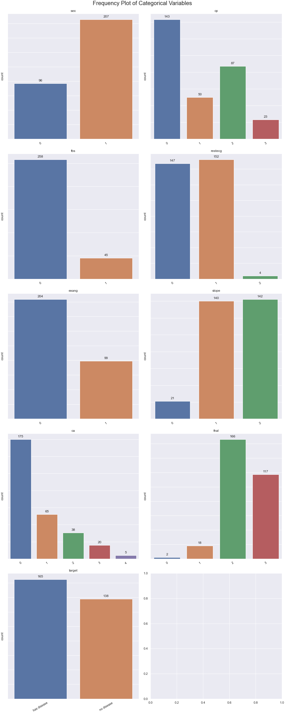
</div>

#### Word Cloud
Exploratory type: **text** data

Development in progress...

### Bivariate Plots 

#### Correlation Plots

Exploratory type: for numerical and numerical data

```python
report.correlation()
```

<div align="center">
  
</div>

<div align="center">
  
</div>

<div align="center">
  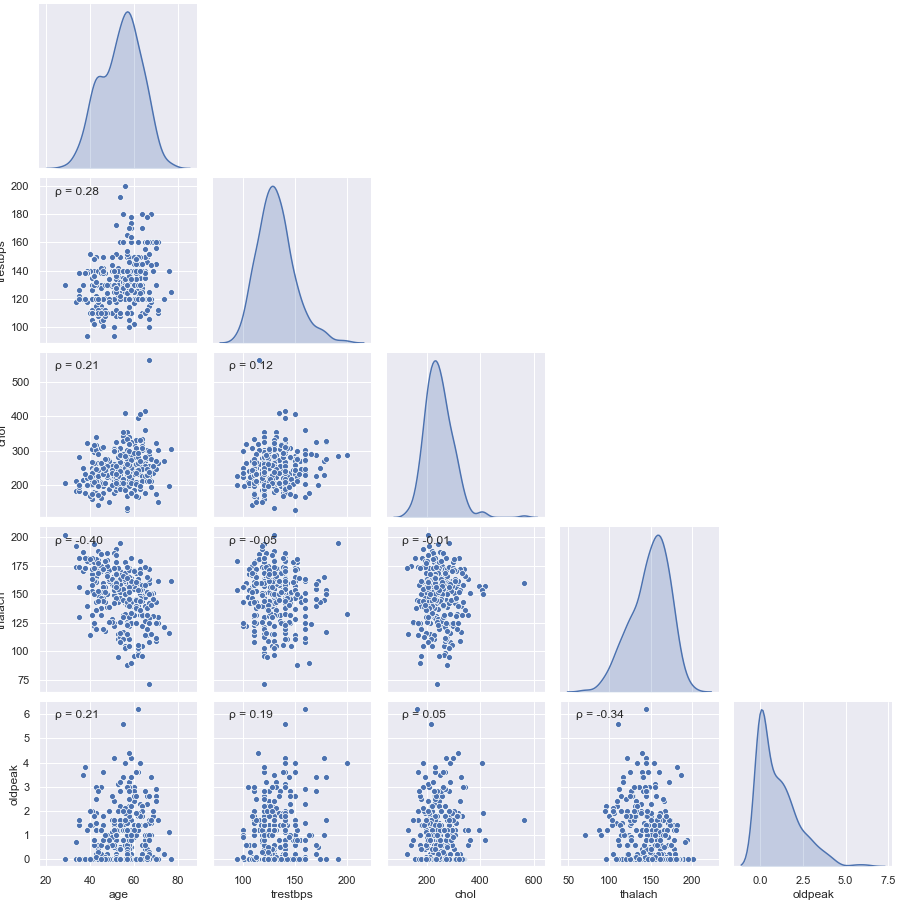
</div>

<div align="center">
  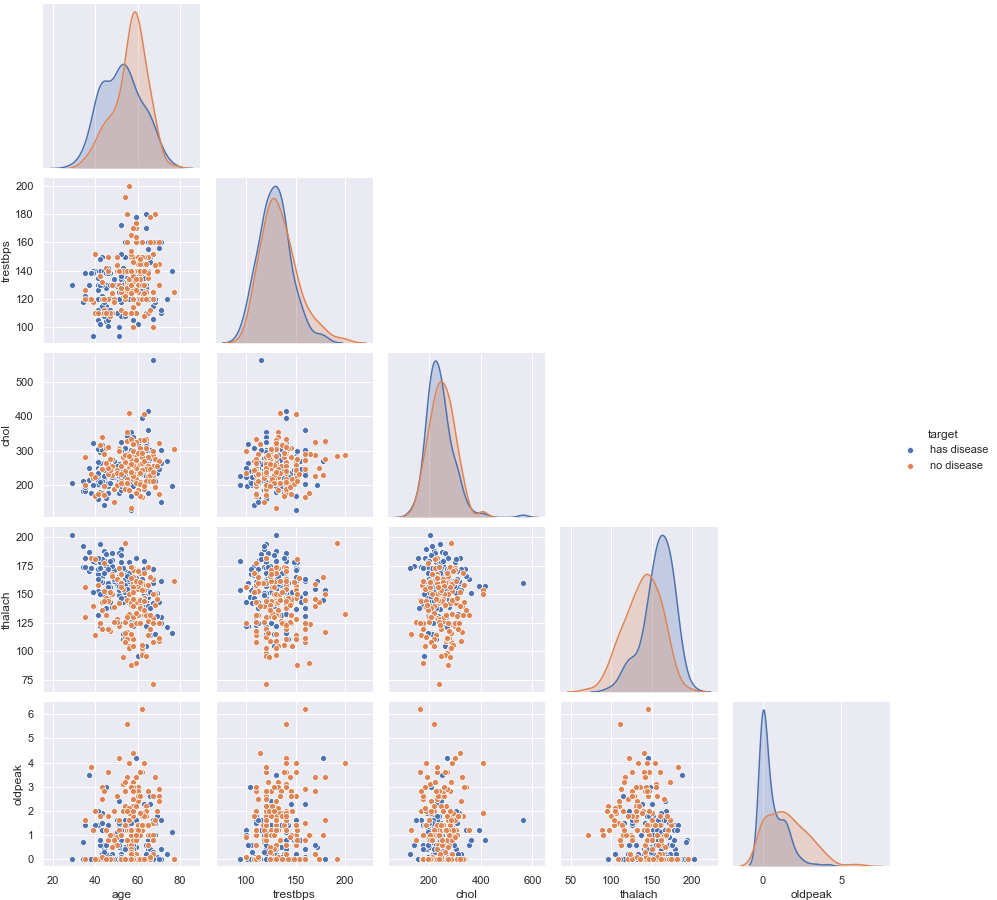
</div>

#### Principal Component Analysis

Exploratory type: **dimensionality reduction**
    
```python
report.pca()
```

<div align="center">
  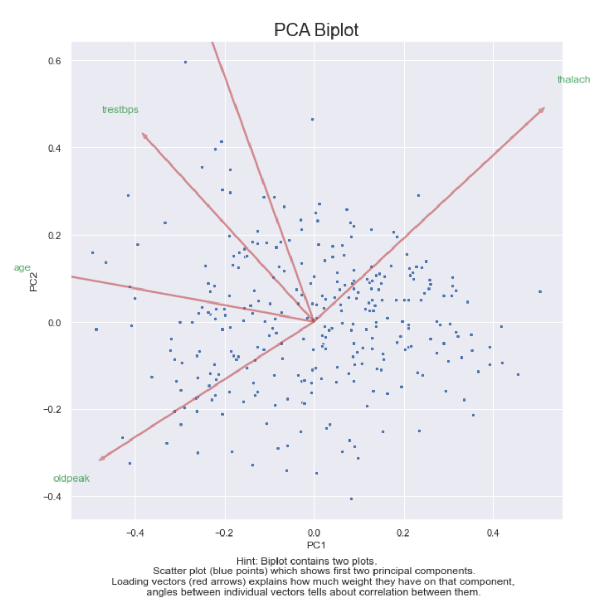
</div>

#### Box Plots 

Exploratory type: **numerical** and **categorical** data

```python
report.boxplots()
```

<div align="center">
  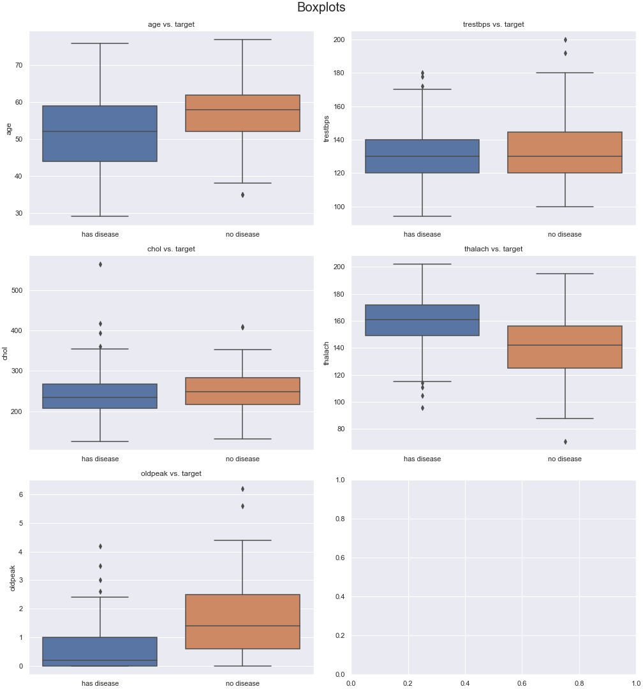
</div>

#### Relative Frequency Plots 

Exploratory type: **categorical** and **categorical** data

```python
report.cat_plots()
```

<div align="center">
  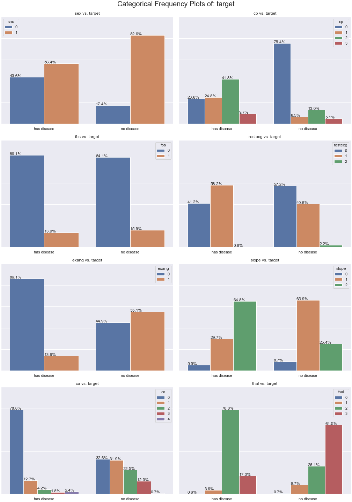
</div>

#### Correspondence Analysis

Exploratory type: **categorical** and **categorical** data

    ```python
    report.correspondence_analysis()
    ```
    
   <div align="center">
      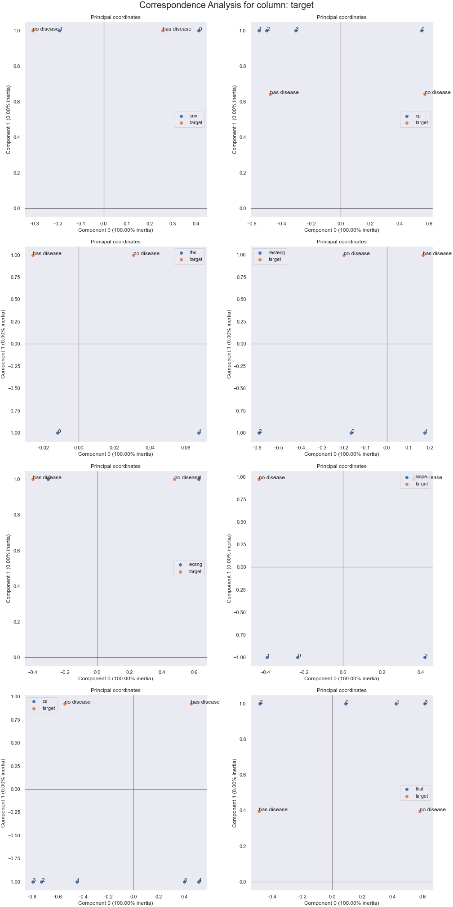
   </div>
    
#### Trend Plot 

Exploratory type: **timeseries** data

```python
report.timeseries_plots(grouper = 'M')
```

<div align="center">
  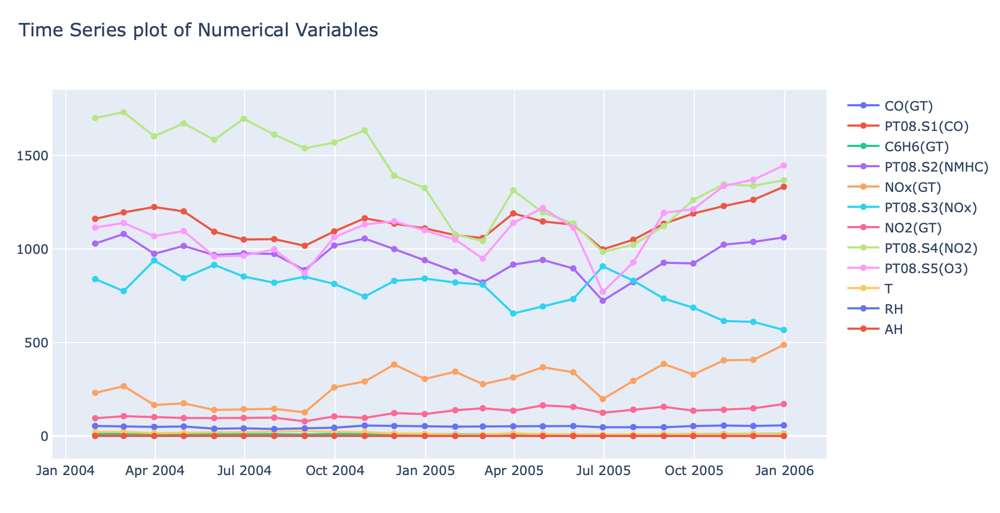
</div>

The available parameters are:

- `grouper`: aggregate the timeseries with a time interval (default = 'W' for 1 week) using mean. This argument is used to reduce the datetime points we have to plot.

### Statistical Modeling

User can specify a target variable for classification/regression task using Classification And Regression Tree (CART).

1. Classification Report (train on 75% of data, test on 25%)

```python
report.tree_model(max_depth = 4)

Classification Report on 25% of Testing Data:
              precision    recall  f1-score   support

 has disease       0.85      0.85      0.85        41
  no disease       0.83      0.83      0.83        35

    accuracy                           0.84        76
   macro avg       0.84      0.84      0.84        76
weighted avg       0.84      0.84      0.84        76

```

2. Bar chart of relative feature importance

<div align="center">
  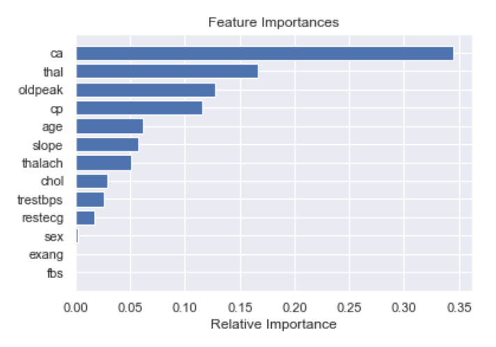
</div>

3. Decision tree visualization with Dtreeviz

<div align="center">
  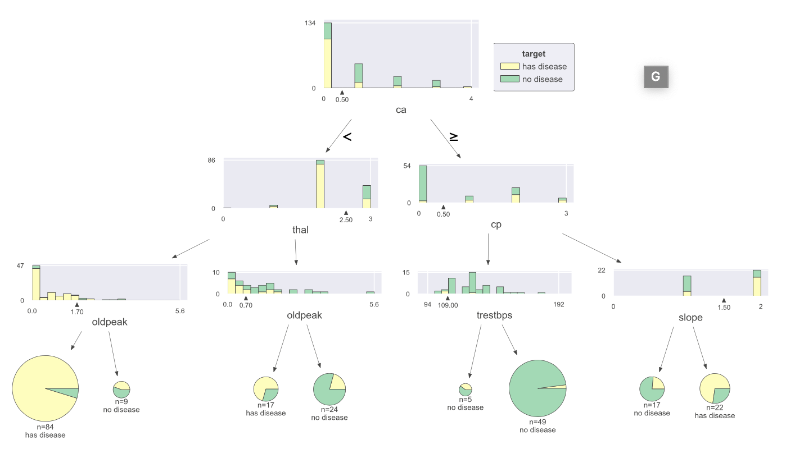
</div>

