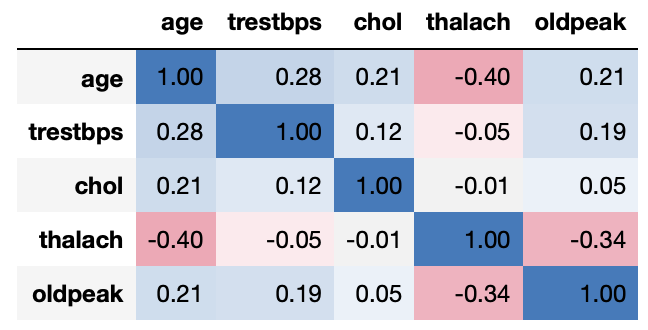
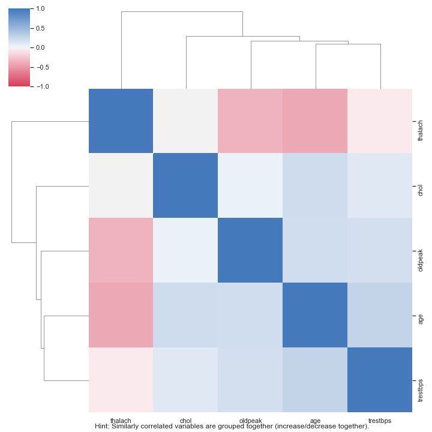

<div align="center">
  
</div>


## Introduction

Throughout my data science journey, I have learned that it is a good practice to understand the data first and try to gather as many insights from it. Exploratory Data Analysis (EDA) is all about making sense of data in hand, before getting dirty with machine learning and sophiticated algorithm. 

While there are plenty of Python libraries that can help create beautiful and complex visualizations, I often find myself starting with the most simplistic analyses: count plot, histogram, scatter plot, boxplot, etc. This initial EDA workflow is very similar for each new data set. But unfortunately, they are tedious. Converting to correct data types, selecting the right variable type for the right plot, itterate through all possible variable combinations, adjusting plot asthetic and labels, etc. These are the tasks I would love to do... once. As someone that does not find great joy in completing repetitive tasks, I set out to build a tool that allow me to me as lazy as possible.

## Description
Auto_EDA is a python library that automates common tasks in your exploratory data analysis. This includes missing values visualization, missing values handling, variable types handling, predictive modeling and a variety of univariate and bivariate graphs. The goal is to provide a fast and effective tool for discovering insights, so you can quickly move on machine learning model.

## Table of Contents

- [Table of contents](#table-of-contents)
- [Installation](#installation)
- [Dataset Overview](#dataset-overview)
- [Missing Values Handling](#Missing-Values)
- [Variable Types Handling](#Variable-Types)
- [Visualization](#Visualization)
  - [Univariate plots](#Univariate-plots)
  - [Bivariate plots](#Bivariate-plots)
- [Decision Tree Visualizer](#Statistical-Modeling)
  

## Installation

:warning: Auto_EDA is only compatible with **Python 3**.

:warning: Decision Tree visualizer requires [graphviz](https://github.com/parrt/dtreeviz).

**Install Via GitHub**

```sh
> pip install git+https://github.com/GrandPurpleOcelot/Auto-EDA 
```
## Usage

```python
from auto_eda import *;
```

Initiate a class instance with input dataframe:

```python
heart = pd.read_csv('datasets/heart.csv')
heart['target'] = np.where(heart['target'] == 1, 'has disease', 'no disease')

report = auto_eda(heart, target_variable = 'target')
```

The available parameters are:

- `df`: the input pandas dataframe.
- `target_variable`: the target variable that Auto_EDA will focus on.

### Descriptive Statistics

####  Dataset Overview

```python
report.get_samples()
```

get_samples() returns a df concatenated from head + random samples + tail of the dataset.

<div align="center">
  
</div>

```python
>>> report.get_overview()

Number of Variables: 303
Number of Observations: 14
Memory Usage: 0.052106 Mb
```
get_samples() returns number of variables, observations, and memory usage.


### Missing Values

1. Visualize missing values using heatmap

```python
report.get_missings(missing_tag=-200)
```

<div align="center">
  
</div>

<div align="center">
  
</div>

<div align="center">
  
</div>

2. Handling missing values

```python
>>> report.handle_missings(strategy = 'deletion', drop_threshold = 0.5)

Dropped columns: ['NMHC(GT)']
Number of dropped rows: 2416 --> 25.8% of rows removed
```

### Variable Types

1. Print out current data types from Pandas

```python
report.check_data_type()
```
<div align="center">
  
</div>

- Type conversion suggestions: 

 * String datetime -> datetime
 
 * Small interger (for example: boolean)  -> categorical type
 
 * String float -> float
 
 * Maximum cardinality (number of unique == number of observations) -> remove
 
Execute the suggested type conversions:

```python
>>> report.change_data_type()

Column Datetime converts to datetime
```

### Visualization

#### Univariate plots

1. Histogram (for numerical data)

```python
report.histogram()
```

<div align="center">
  
</div>

The available parameters are:

- `kde`: boolean (default = False).

2. Count plot (for categorical data)

```python
report.count_plots()
```

<div align="center">
  
</div>

3. World cloud (for text data)

Development in progress...

#### Bivariate plots 

User can specify a categorical column for grouping. 

1. Correlation plots (heat map and scatter plot): for numerical and numerical data

```python
report.correlation()
```

<div align="center">
  
</div>

<div align="center">
  
</div>

<div align="center">
  
</div>

<div align="center">
  
</div>
    * Principal Component Analysis
    
    ```python
    report.pca()
    ```
    
   <div align="center">
      
    </div>

2. Box plots: for numerical and categorical data

```python
report.boxplots()
```

<div align="center">
  
</div>

3. Relative frequency plots: for categorical and categorical data

```python
report.cat_plots()
```

<div align="center">
  
</div>
    * Correspondence Analysis
    
    ```python
    report.correspondence_analysis()
    ```
    
   <div align="center">
      
   </div>
    

4. Trend plot (connected scatterplot): if timeseries data is present


### Statistical Modeling

User can specify a target variable for classification/regression task using Classification And Regression Tree (CART).

1. Classification Report (train on 75% of data, test on 25%)

```python
report.tree_model(max_depth = 4)

Classification Report on 25% of Testing Data:
              precision    recall  f1-score   support

 has disease       0.85      0.85      0.85        41
  no disease       0.83      0.83      0.83        35

    accuracy                           0.84        76
   macro avg       0.84      0.84      0.84        76
weighted avg       0.84      0.84      0.84        76

```

2. Bar chart of relative feature importance

<div align="center">
  
</div>

3. Decision tree visualization with Dtreeviz

<div align="center">
  
</div>

